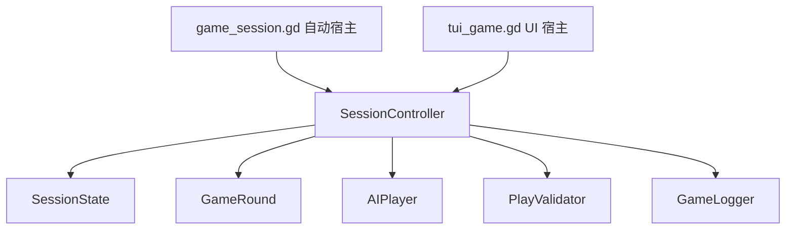

# SessionController 重构执行方案

> **Status**: Completed
> **Branch**: `feature/session-controller-refactor`
> **Worktree**: `D:/WorkDir/session-controller-refactor`
> **Scope**: 抽离共享会话状态与阶段编排；反主暂不实现。

---

## 目标

把 `game_session.gd` 与 `tui_game.gd` 中重复的多局会话编排收敛到共享的 `SessionState` 与 `SessionController`。

本次重构只做现有行为的单点化，不扩大规则范围：

- 保留现有亮主行为：首局先到先得，非首局从当前庄家开始轮询。
- 保留现有配底、出牌、结算、升级、换庄行为。
- 保留 `game_session.gd` 的全自动跑局能力。
- 保留 `tui_game.gd` 的按钮输入、定时器节奏、日志面板和显示逻辑。
- 反主 / CounterWindow 暂不实现，只留下明确 TODO 与接口预留。

---

## 当前问题

- `game_session.gd` 与 `tui_game.gd` 各自维护 `rule_config`、`game_round`、`team_ranks`、`current_dealer`、`current_rank`、`is_first_game`、`round_num`。
- 两个入口各自实现 `deal -> bid -> bury -> trick loop -> settlement`，状态更新存在分叉风险。
- 已知分叉：`tui_game.gd` 局末会把 `is_first_game` 切成 `false`，`game_session.gd` 当前没有同等更新。
- `lead_info` 构造重复，AI 跟牌与人类跟牌的校验输入可能继续分叉。
- `GameRound.play_trick()` 当前默认信任传入牌组，统一 controller 后必须把合法性校验前移到 submit 阶段。

---

## 目标架构



### 设计边界

- `SessionController` 是规则流程核心，不继承 `Control`，不依赖节点树，不调用 `create_timer()`，不创建按钮。
- `SessionController` 不直接 `print()`，不决定日志文件路径。
- TUI 继续负责显示、输入收集、定时器、选牌 UI 和日志保存按钮。
- 自动宿主负责命令行参数、固定 seed、循环跑局、console 输出和退出进程。
- Controller 暴露阶段 API，宿主通过 `submit_*` 推进状态，而不是 controller 同步等待 UI 输入。

---

## 新增文件

### `src/godot/scripts/gameplay/session_state.gd`

职责：

- 持有跨局状态：`team_ranks`、`current_dealer`、`current_rank`、`round_num`、`is_first_game`、`human_seat`、`game_over`。
- 提供纯状态辅助：`get_attack_team(dealer)`、`get_team_rank_for_seat(seat)`、`sync_rank_to_dealer(dealer)`、`get_upgrading_team(settlement, dealer)`、`apply_settlement(settlement, actual_dealer)`。
- `apply_settlement()` 是升级、换庄、首局标记切换的唯一权威实现。

### `src/godot/scripts/gameplay/session_controller.gd`

职责：

- 持有 `rule_config`、`game_round`、`logger`、`SessionState`。
- 统一实现一局的阶段推进：开局、发牌、亮主、配底、出牌、结算。
- 暴露阶段 API：
  - `start_new_session(rule_config, logger, human_seat)`
  - `start_round(seed_value = -1)`
  - `get_bidding_context()`
  - `submit_bid_or_pass(seat, declaration)`
  - `finish_bidding_if_ready()`
  - `get_bury_context()`
  - `submit_bury(indices)`
  - `begin_trick()`
  - `get_current_turn_context()`
  - `submit_play(seat, cards)`
  - `finish_round()`
- 统一构造 `lead_info`。
- 对所有 `submit_play()` 做合法性校验，包括 AI、自动宿主和 TUI 人类输入。

### 不新增 `SessionPresenter`

本轮暂不做 Presenter 抽象。原因：现阶段的核心风险是流程重复和状态双写，不是展示层复用。过早抽 `SessionPresenter` 会增加接口面，并可能把 UI 细节反向拉进 controller。

### 不新增同步 `SeatPolicy` 接口

本轮不做会阻塞式的 `request_bid/request_bury/request_play`。TUI 输入天然异步，强行用同步策略接口会让 controller 难以同时服务自动宿主和 UI 宿主。

自动宿主可以在自身循环中调用 AI，然后立即调用 controller 的 `submit_*`。TUI 则在按钮回调中调用同一批 `submit_*`。

---

## 分阶段执行

每个阶段都必须满足：

- 全量单元测试通过。
- 当前阶段改动本地提交一次。
- 只提交当前阶段相关改动，不推送。

推荐测试命令：

```powershell
Set-Location D:\WorkDir\session-controller-refactor\src\godot
godot --headless --script addons/gut/gut_cmdln.gd -gdir=res://tests
```

如果本机 Godot 命令不可用，必须记录未执行原因，不能假装通过。

### Phase 1: 抽离 `SessionState`

目标：

- 新增 `session_state.gd`。
- 把跨局状态辅助逻辑从两个宿主中复制到生产类。
- 不改宿主主流程，只先让测试覆盖生产 `SessionState`。

改动范围：

- 新增 `src/godot/scripts/gameplay/session_state.gd`
- 新增或改造 `src/godot/tests/test_session_state.gd`
- 可逐步替换 `test_team_ranks.gd` 中的测试 helper，使其验证真实生产逻辑。

验收：

- `SessionState.apply_settlement()` 覆盖庄家方升级、攻方升级、下庄不升级、游戏结束、下一局庄家沿用实际庄家。
- `is_first_game` 在第一局结算后统一切为 `false`。
- 全量测试通过。
- 本地提交，建议信息：`S2-09: extract session state`

### Phase 2: 建立 `SessionController` 骨架

目标：

- 新增 controller，但先只迁移不会碰 UI 输入的部分。
- `start_round()` 统一创建 `GameRound`、设置当前级、发牌、开始日志。
- `finish_round()` 统一结算并调用 `SessionState.apply_settlement()`。

改动范围：

- 新增 `src/godot/scripts/gameplay/session_controller.gd`
- 新增 `src/godot/tests/test_session_controller.gd`
- 暂不大改 `game_session.gd` / `tui_game.gd`

验收：

- controller 能用固定 seed 开一局并持有有效 `GameRound`。
- controller 结算时使用攻方自己的等级作为 `attack_rank`。
- `logger.begin_round()`、`logger.update_round_rank()`、`logger.end_round()` 没有重复调用。
- 全量测试通过。
- 本地提交，建议信息：`S2-09: add session controller skeleton`

### Phase 3: 统一亮主与配底阶段 API

目标：

- 把亮主轮询与配底提交收敛到 controller。
- 保留现有亮主行为，不实现反主。

改动范围：

- `SessionController` 增加 bidding/burying 状态。
- `game_session.gd` 改为通过 controller 自动提交亮主和配底。
- `tui_game.gd` 人类亮主按钮与扣底按钮改为调用 controller submit。

验收：

- 首局：人类可亮则等待人类；人类跳过后 AI 轮询；一旦有人亮主即结束。
- 非首局：从当前庄家开始轮询，直到有人亮主或无人亮主默认公主局。
- 无人亮主时默认当前庄家，公主局。
- 亮主后 `current_rank` 同步到实际庄家队伍等级，并更新 logger。
- 配底成功后进入出牌阶段；配底失败不推进。
- 反主路径不存在运行入口，但代码中保留 TODO。
- 全量测试通过。
- 本地提交，建议信息：`S2-09: route bidding and burying through controller`

### Phase 4: 统一出牌阶段 API 与 `lead_info`

目标：

- `SessionController.submit_play()` 成为所有出牌的唯一入口。
- `lead_info` 构造单点化。
- 所有出牌都走 `PlayValidator`，包括 AI 自动出牌。

改动范围：

- `SessionController` 增加 trick state：当前墩、座位顺序、当前 turn、已出牌、`lead_info`。
- `game_session.gd` 自动循环调用 AI 决策并 submit。
- `tui_game.gd` 人类选牌后 submit，AI turn 由 TUI 调用 AI 决策后 submit，定时器仍留在 TUI。

验收：

- 先手出牌调用 `PlayValidator.validate_lead()`。
- 跟牌调用 `PlayValidator.validate_follow()`，并传入 `lead_pattern`。
- 非当前座位 submit 被拒绝。
- 牌数不一致、非法跟牌、空出牌被拒绝，且不修改 `GameRound.hands`。
- 每墩四家提交后才调用 `GameRound.play_trick()`。
- `lead_info` 不再由两个宿主各自拼装。
- 全量测试通过。
- 本地提交，建议信息：`S2-09: centralize trick submission`

### Phase 5: 收敛两个宿主

目标：

- `game_session.gd` 降级为自动宿主。
- `tui_game.gd` 降级为 UI 宿主。
- 删除两个文件中重复的跨局状态和完整流程编排。

改动范围：

- `game_session.gd`
- `tui_game.gd`
- 必要时补少量宿主适配 helper。

验收：

- 两个宿主都通过同一个 `SessionController` 更新 `is_first_game/current_dealer/team_ranks/current_rank`。
- `game_session.gd` 保留 `--seed`、自动跑局、console 输出、日志保存。
- `tui_game.gd` 保留按钮、选牌高亮、非法输入提示、定时器节奏、日志面板、重开/重置按钮。
- 宿主不再直接调用 `GameRound.calculate_settlement()` 应用跨局状态。
- 全量测试通过。
- 本地提交，建议信息：`S2-09: migrate hosts to session controller`

### Phase 6: 集成回归与清理

目标：

- 补 controller 级完整路径测试。
- 清理死代码和重复 helper。
- 更新文档状态。

改动范围：

- `src/godot/tests/test_session_controller.gd`
- `production/sprints/session-controller-refactor-plan.md`
- 必要的 `CHANGELOG.md`

验收：

- 覆盖一条完整自动路径：开局 -> 亮主或无人亮主 -> 配底 -> 至少一墩出牌 -> 可控结算/状态应用。
- 覆盖两入口共享路径的静态断言或行为测试：宿主只持有 controller，不再各自维护核心跨局状态。
- 全量测试通过。
- 本地提交，建议信息：`S2-09: add controller regression coverage`

---

## 明确不做

- 不实现反主 / CounterWindow。
- 不重写 `TrumpBidding` 强度规则。
- 不改 UI 视觉结构。
- 不改日志文件落盘路径策略。
- 不引入网络玩家或真正异步 await controller。

---

## 风险控制

- 每阶段提交，方便在具体阶段回滚，而不是一次性大爆炸提交。
- 先测试 `SessionState`，再迁移宿主，避免状态语义和 UI 重构混在一起。
- Controller 阶段 API 用返回值表达推进结果，例如 `{ "ok": bool, "phase": String, "error": String }`，宿主只根据结果刷新 UI 或继续自动流程。
- 所有会修改手牌的操作必须先校验再调用 `GameRound`。
- 对日志事件做单点归属：`GameRound` 继续记录单局事实，`SessionController` 只负责阶段和跨局状态，不重复记录已由 `GameRound` 记录的出牌/结算细节。

---

## 完成标准

- [x] `game_session.gd` 与 `tui_game.gd` 不再各自维护完整会话编排。
- [x] `is_first_game`、`team_ranks`、`current_dealer`、`current_rank` 的更新只有一个权威实现。
- [x] 自动宿主与 TUI 宿主使用同一套 controller 阶段 API。
- [x] 全量单元测试通过。
- [x] 每个阶段都有本地提交，且未推送。
